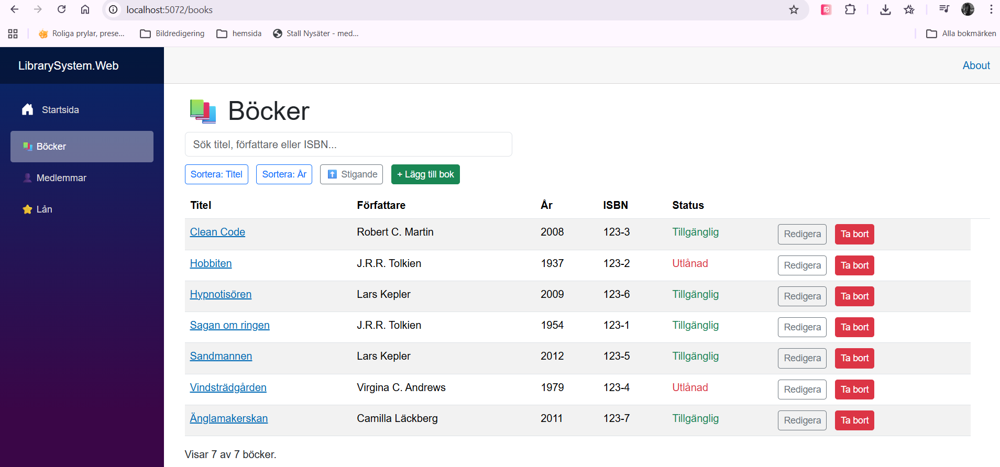
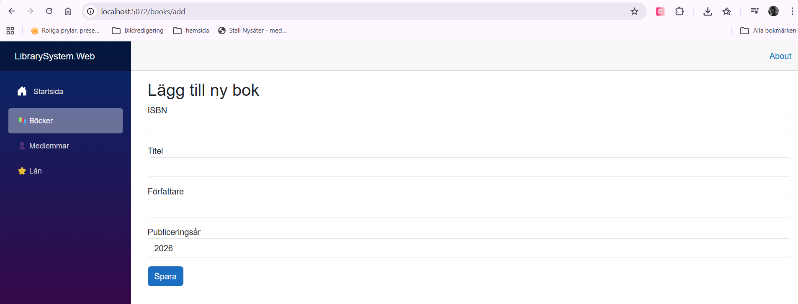
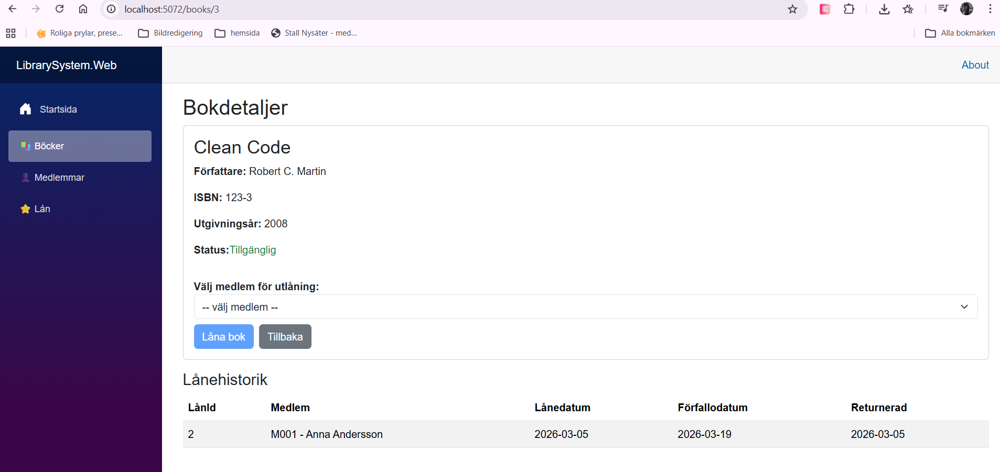
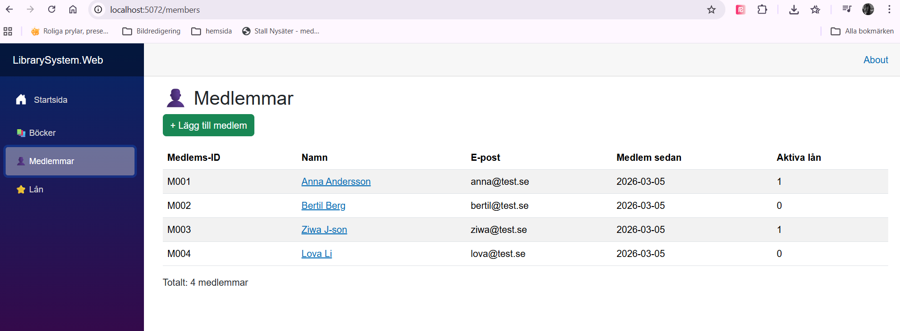
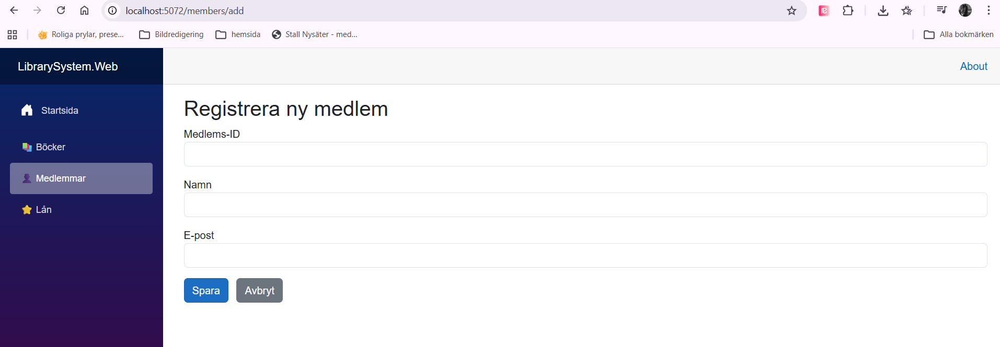
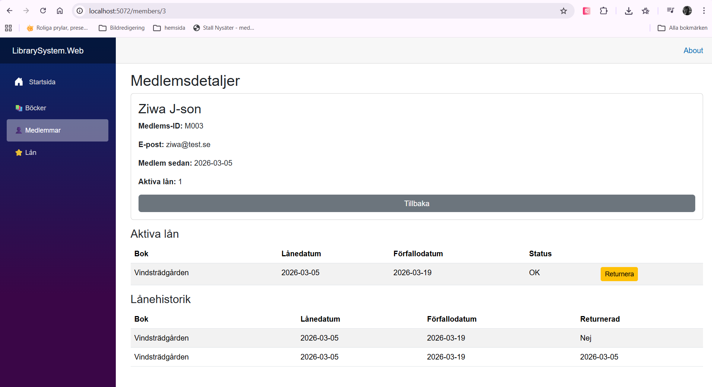
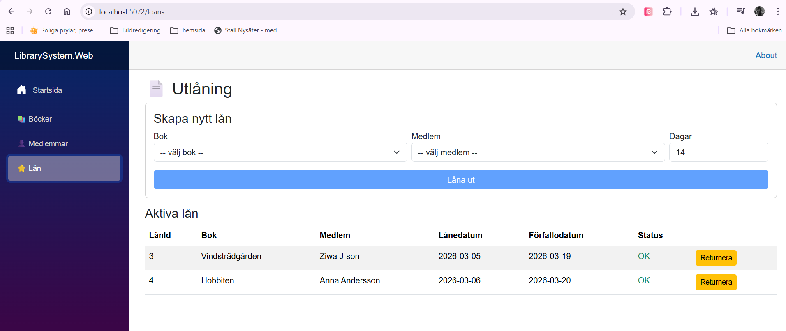

# LibrarySystem_vers_2
Ett bibliotekssystem byggt i **C# / .NET** med:

- Entity Framework Core
- SQLite databas
- Blazor Server (webbgränssnitt)
- Repository Pattern
- xUnit enhetstester

Projektet är en vidareutveckling av ett konsolbaserat bibliotekssystem och 
demonstrerar hur **backend (EF Core)** och **frontend (Blazor)** 
samverkar i en modern .NET-applikation.

## Funktioner
- Hantera böcker: Lägg till, redigera, ta bort och visa böcker i biblioteket.
- Hantera låntagare: Lägg till, redigera, ta bort och visa låntagare.
- Hantera lån: Låna ut och återlämna böcker, samt visa aktuella lån.

Funktioner i webbgränssnittet inkluderar:
- Navigering mellan olika sidor (böcker, låntagare, lån)
- Visa alla böcker
- Söka och sortera böcker
- Lägga till bok
- Redigera bok
- Ta bort bok
- Visa bokdetaljer
- Visa medlemmar
- Registrera ny medlem
- Visa medlemsinformation
- Skapa och returnera lån
- Visa aktiva lån

------

# Projektstruktur
LibrarySystem/

├── LibrarySystem.Core # Domänmodeller

├── LibrarySystem.Data # Entity Framework + Repositories

├── LibrarySystem.Web # Blazor webbapplikation

├── LibrarySystem.ConsoleApp # Konsoltest av databasen

└── LibrarySystem.Tests # xUnit tester

------

# Databasmodell (fält (typ) i varje tabell)
Databasen består av tre huvudtabeller: Books, Members och Loans.

## Books: 
Id (int), Title (string), Author (string), ISBN (string), PublishYear (int), IsAvailable (bool)
Relationer:
- En bok kan ha **många lån**
Book1 ---- * Loan

## Members:
Id (int), Name (string), Email (string), MemberSins (DateTime)
Relationer:
- En medlem kan ha **många lån**
Member1 ---- * Loan

## Loans:
Id (int), BookId (int), MemberId (int), LoanDate (DateTime), DueDate (DateTime), ReturnDate (DateTime?)
Relationer:
Book1 ---- *Loan* ---- 1 Member

------

# Repository Pattern
Projektet använder Repository Pattern för att separera databaslogik från affärslogik.
Exempel:
IBookRepository
BookRepository
IMemberRepository

Detta gör koden:
- mer testbar
- mer modulär
- enklare att underhålla

------

# Enhetstester
Projektet innehåller **xUnit tester** för:
- Repository
- CRUD-operationer
- Integration mellan EF Core och affärslogik

Tester använder **EF Core InMemory database**.

Kör tester med:
dotnet test

------

# Hur man kör projektet

## 1 Installera beroenden
dotnet restore

## 2 Skapa databasen
dotnet ef database update --project LibrarySystem.Data --startup-project LibrarySystem.Web
Detta skapar SQLite databasen:
library.db

## 3 Starta webbapplikationen
dotnet run --project LibrarySystem.Web
Öppna sedan webbläsaren:
https://localhost:xxxx

------

# Blazor-gränssnitt

## Boklista
Visar alla böcker med sökning och sortering.

## Lägg till bok
Formulär för att registrera nya böcker.

## Bokdetaljer
Visar detaljerad information om en bok.

## Medlemmar
Lista över registrerade medlemmar.

## Lägg till medlem
Formulär för att registrera nya medlemmar.

## Medlemsdetaljer
Visar detaljerad information om en medlem.

## Lån
Visar aktiva lån och markerar försenade lån.

------

# Tekniker
Projektet använder:
- **C#**
- **.NET**
- **Entity Framework Core**
- **SQLite**
- **Blazor Server**
- **xUnit**
- **Dependency Injection**

------
# Extra funktionalitet
Utöver grundkraven implementerar systemet:
- Bokredigering
- Sortering av böcker
- Sökfunktion
- Returnering av lån via UI
- Repository Pattern
- Asynkrona databasoperationer

------

# Författare

Projekt skapat som del av kursuppgift i **.NET / C# applikationsutveckling**.